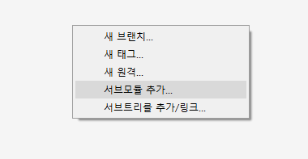

# human framework

## 1. git submodule 추가

로컬 경로 : 프로젝트 루트/extension/human-framework

## 2. SourceTree 서브모듈 업데이트 커스텀 액션

## 3. 서브 모듈 업데이트 가이드

!주의! 

서브모듈은 독립된 Git입니다. 따로 버전관리가 됩니다.

서브모듈 업데이트를 하게 되면 연결된 서브모듈 Git과 nested 서브모듈까지 모두 Pull을 받게됩니다.

